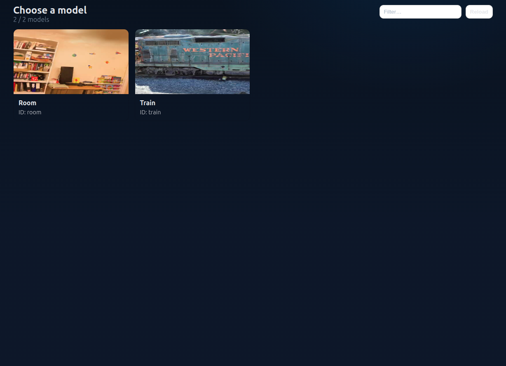
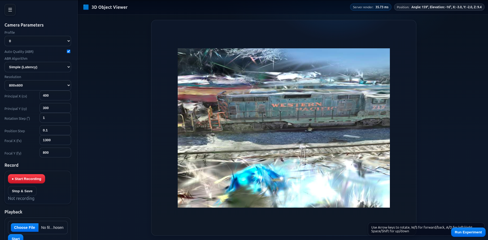
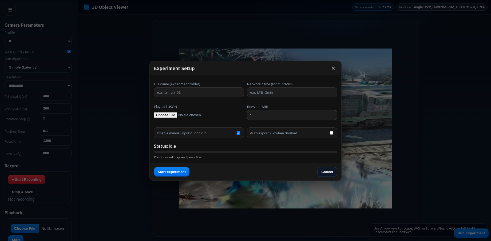

# Gaussian Adaptive Streamer
Gaussian Adaptive Streamer is a prototype system for adaptive streaming of 3D Gaussian Splatting scenes over modern web transport protocols. The project combines HTTP/3-based delivery, DASH-style adaptive streaming, and server-side Gaussian model handling to efficiently stream large neural rendering datasets to a client.Gaussian Adaptive Streamer

# Requirements

+ Nvidia GPU with driver.
+ FFMPEG with h642_nvenc encoder
+ Python dependencies are listed in requirements.txt.

## Directory structure

Create a models directory in the project root and place all models inside it:

```bash
project_root/
├── static
│    └── models/
│       ├── modelID/
│       │   ├── modelName.ply
│       │   └── preview.jpg
│       └── anotherModelID/
│           ├── anotherModelName.ply
│           └── anotherPreview.jpg
└── requirements.txt
```

These models and previews will be loaded automatically when starting the server.

## Installation

Create a clean Python environment and install the project dependencies.

### 1. Create environment

```bash
conda create -n render python=3.12 -y
conda activate render
```

### 2. Install dependencies

```bash
python -m pip install --upgrade pip
python -m pip install -r requirements.txt
```

### 3. Verify PyTorch + CUDA

```bash
python -c "import torch; print('Torch:', torch.__version__); print('CUDA available:', torch.cuda.is_available())"
```
### 4. Notes

+ The requirements.txt installs CUDA 11.8 PyTorch wheels from the official PyTorch wheel index.

- This project was developed and tested with CUDA 11.8. There is no guarantee that other CUDA versions will work.

- GPU execution also depends on a compatible NVIDIA driver. Systems with incompatible drivers may fail to initialize CUDA.

- The environment was tested with Python 3.12. Other Python versions may not have compatible wheels for the specified PyTorch/CUDA combination.

**If GPU support fails, verify:**

+ nvidia-smi works

+ the installed driver version supports CUDA 11.8

+ the correct PyTorch CUDA wheels were installed.

## Running the Server

Start the streaming server:

```bash
python http3_server.py --certificate certificates/ssl_cert.pem --private-key certificates/ssl_key.pem
```

Start Google Chrome with flags:

Linux:
```bash
 google-chrome \
  --enable-experimental-web-platform-features \
  --ignore-certificate-errors-spki-list=BSQJ0jkQ7wwhR7KvPZ+DSNk2XTZ/MS6xCbo9qu++VdQ= \
  --origin-to-force-quic-on=localhost:4433 \
  https://localhost:4433/models-ui
```

**Note:**
- For trying the experimental version with dash.js as player type instead of /models-ui, go to /player-dash.
- Close Google Chrome before running this command.


## Preview

### Model Selection



### Viewer



### Experiment

